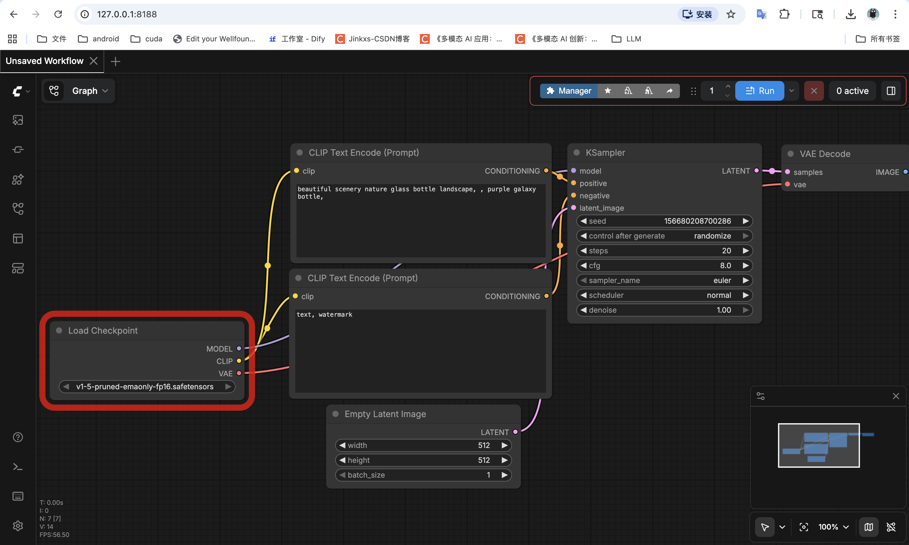

# Stable Diffusion 从 0 到 1（本仓库说明）
文章只讲述如何使用sd开发, 不对生成的效果负责, 具体效果需要根据场景需求反复微调
本文记录在本机（Mac）上从零搭建、使用 Stable Diffusion 的完整路径：**不污染系统与全局 Python**，包含 **ComfyUI（可视化）** 与 **`python-sd`（代码调用）** 两条线。

---

## 1. 目录与职责（最外层）

建议把本仓库当作「SD 学习与实验根目录」，典型结构如下：

| 路径 | 说明 |
|------|------|
| `sd-learn/` | **独立 Conda 环境目录**（Python 3.10 + 依赖），与系统、其他项目隔离 |
| `python-sd/` | **脚本学习区**：文生图、调参、LoRA、ControlNet、视频等课程脚本 |
| `ComfyUI/` | **ComfyUI 安装目录**（若已克隆）：工作流出图/出视频 |
| `课程_StableDiffusion_从入门到生产/` | 分课 Markdown 学习材料 |
| `SD_从部署到生产图片视频_完整流程.md` | 精简版总流程与选型说明 |
| `SD_面试模板.md` | 面试口述模板 |
| `.cursor/skills/sd-common-pitfalls/` | 常见坑检查清单（给 Cursor / 自己复盘用） |

---

## 2. 为什么单独建 `sd-learn`？

- **避免污染**：不把 `torch`、`diffusers` 等装到系统 Python 或 `base` 里。  
- **可卸载**：学完后删除 `sd-learn/` 与相关目录即可整体回收。  
- **可复现**：PyCharm / 终端统一 `conda activate` 到同一路径，版本一致。

创建方式示例（本地路径环境，不占用全局 env 名）：

```bash
conda create -y -p /Users/tfwang/LLM/sd/sd-learn python=3.10
```

日常使用：

```bash
source /opt/miniconda3/etc/profile.d/conda.sh
conda activate /Users/tfwang/LLM/sd/sd-learn
```

解释器路径（PyCharm 里可选）：  
`/Users/tfwang/LLM/sd/sd-learn/bin/python`

---

## 3. ComfyUI：下载、安装、部署、使用

### 3.1 获取代码

在仓库根目录执行（若尚未克隆）：

```bash
cd /Users/tfwang/LLM/sd
git clone https://github.com/comfyanonymous/ComfyUI.git
```

### 3.2 安装依赖

```bash
source /opt/miniconda3/etc/profile.d/conda.sh
conda activate /Users/tfwang/LLM/sd/sd-learn
python -m pip install -r /Users/tfwang/LLM/sd/ComfyUI/requirements.txt
```

### 3.3 模型放哪里

将下载的 checkpoint（如 `.safetensors`）放到：

- `ComfyUI/models/checkpoints/`

其他类型（VAE、LoRA、ControlNet 等）对应 `ComfyUI/models/` 下各子目录，按 ComfyUI 文档放置即可。

### 3.4 启动服务

```bash
cd /Users/tfwang/LLM/sd/ComfyUI
source /opt/miniconda3/etc/profile.d/conda.sh
conda activate /Users/tfwang/LLM/sd/sd-learn
python main.py --listen 127.0.0.1 --port 8188
```

浏览器打开：`http://127.0.0.1:8188`



### 3.5（可选）ComfyUI-Manager

用于安装自定义节点等，克隆到：

`ComfyUI/custom_nodes/ComfyUI-Manager`

具体命令见 ComfyUI-Manager 官方仓库说明；装完后重启 ComfyUI。

---
作为程序员怎么能用可视化界面呢, 肯定要用代码来实现文生图
talk is cheap, show me your code 

**注意: 我电脑配置有限, 使用的是stable-diffusion-v1-5小模型, 输入token限制77个, 所以效果不好, 但可以用来学习sd开发的流程!!!**

## 4. 「SD 代码路径」：`python-sd` 怎么用

所有**用 Python 调 diffusers / 跑课程脚本**的内容都在：

**`/Users/tfwang/LLM/sd/python-sd`**

### 4.0 为何示例里用英文 prompt，注释里也常写英文？

- **模型与训练数据（有据可查）**：Stable Diffusion **v1 系（含 1.5）**主要在 **LAION-2B(en)** 等以**英文说明**为主的子集上训练；CompVis 发布的 [Stable Diffusion v1 Model Card](https://github.com/CompVis/stable-diffusion/blob/main/Stable_Diffusion_v1_Model_Card.md) 写明 **Language(s): English**，并明确写：**训练以英文 caption 为主、其它语言效果较差**（*non-English prompts significantly worse than English-language prompts*）。因此**示例 prompt 用英文**通常更稳、更易与社区模型卡 / LoRA 说明里的 tag 对齐。
- **注释里写英文的原因**：与「真正进 CLIP 的字符串」保持一致，减少「注释用中文长句描述、误以为模型也按同样语义理解」的落差；示例词与海外教程、ComfyUI 节点习惯一致，便于复制对照。**本仓库的总体说明、课程 Markdown 仍以中文为主**；只有脚本内与生成强相关的片段偏向英文。

### 4.1 环境

必须先激活 `sd-learn`（见上文）。

### 4.2 建议安装的核心依赖

```bash
conda activate /Users/tfwang/LLM/sd/sd-learn
python -m pip install -U diffusers transformers accelerate safetensors peft
```

部分课程还需要：

```bash
python -m pip install opencv-python "imageio[ffmpeg]"
```

### 4.3 快速出图：`generate_image.py`

在 `python-sd` 目录下，编辑脚本里的 **`CONFIG`**（正向/负向提示词、宽高、steps、cfg、seed 等），然后在 IDE 或终端直接运行：

```bash
cd /Users/tfwang/LLM/sd/python-sd
conda activate /Users/tfwang/LLM/sd/sd-learn
python generate_image.py
```
输出默认在：`python-sd/outputs/`


### 4.4 分课脚本

索引见：`python-sd/00_course_index.md`  

按顺序大致为：`lesson01` 文生图 → `lesson02` 参数对比 → `lesson03` 图生图 → `lesson04` LoRA → `lesson05` ControlNet → `lesson06` 视频等。每个脚本顶部有 **`CONFIG` / `PROFILE`**，改配置后运行即可。

---

## 5. 与「只装 ComfyUI」的关系

- **ComfyUI**：适合拖拽工作流、快速试节点与出图/视频。  
- **`python-sd`**：适合学参数、写脚本、面试时说「我用代码跑通过 pipeline」。  

两者可共用 **`sd-learn`** 环境，模型文件也可各自引用（ComfyUI 用 `models/`，脚本里常用 Hugging Face Hub 或本地路径）。

---

## 6. 常见坑（务必扫一眼）

更完整的清单见：`.cursor/skills/sd-common-pitfalls/SKILL.md`  

摘要：

- **SD1.5 文本长度**：CLIP 侧常见约 **77 tokens**，prompt 过长会被截断；宜短而准。  
- **宽高**：须为 **8 的倍数**。  
- **Mac / MPS**：注意显存与共享内存，分辨率与步数先从低再拉高。  
- **LoRA**：需 `peft`；文件须为真实 LoRA，不是整包 checkpoint。  

---

## 7. 学习完如何卸载（回收空间）

按需删除（注意路径写对）：

```bash
# 删除独立环境与代码、ComfyUI（按你实际存在的目录删）
rm -rf /Users/tfwang/LLM/sd/sd-learn
rm -rf /Users/tfwang/LLM/sd/python-sd/outputs
rm -rf /Users/tfwang/LLM/sd/ComfyUI
```

Hugging Face 缓存一般在 `~/.cache/huggingface/`，若需彻底清空间可另行清理（会删掉所有 HF 缓存模型）。

---

## 8. 延伸阅读（本仓库内）

- `SD_从部署到生产图片视频_完整流程.md`：模型选型、参数、排错、卸载要点  
- `SD_面试模板.md`：面试怎么讲这条链路  
- `课程_StableDiffusion_从入门到生产/`：分课文字教材  

---

**一句话**：用 **`sd-learn`** 锁住依赖与环境，用 **ComfyUI** 做可视化实验，用 **`python-sd`** 做可复现的代码学习；需要排错时对照 **`sd-common-pitfalls`** 清单即可。
